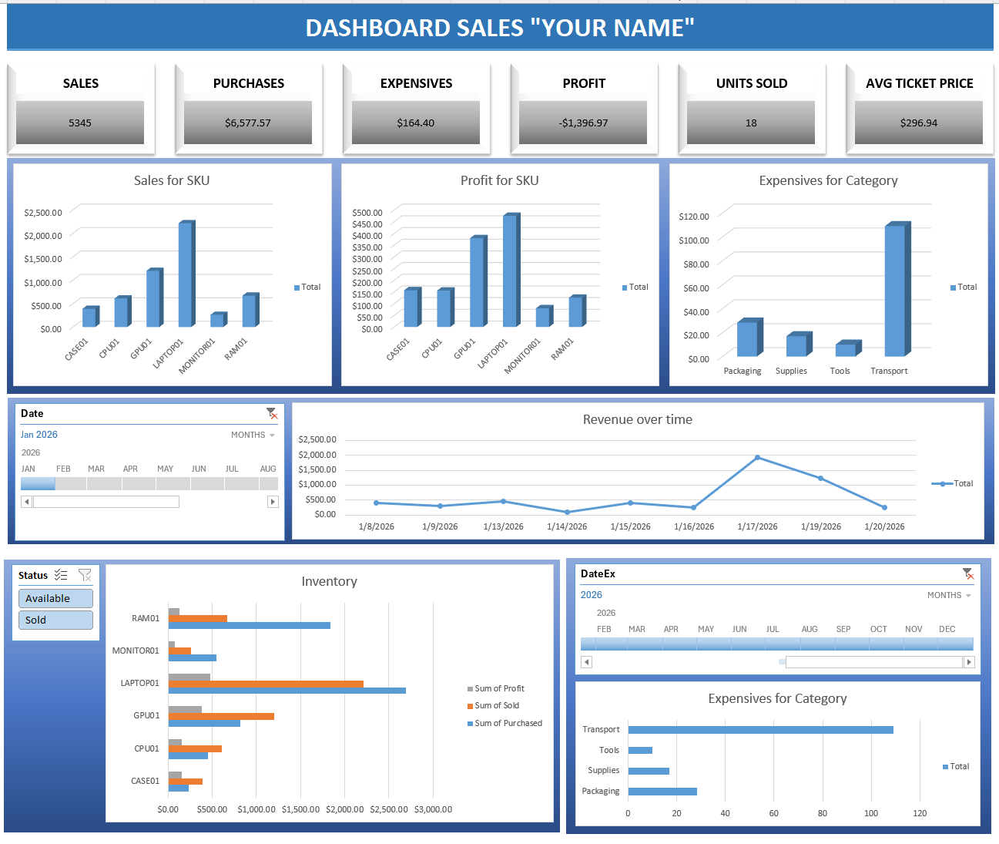
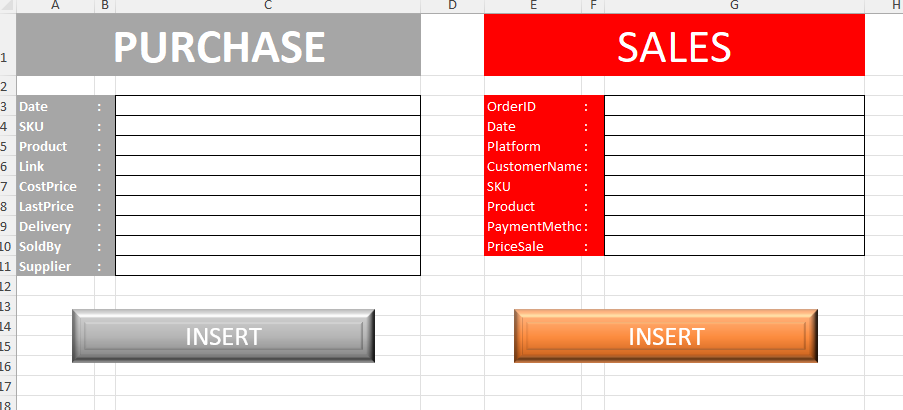
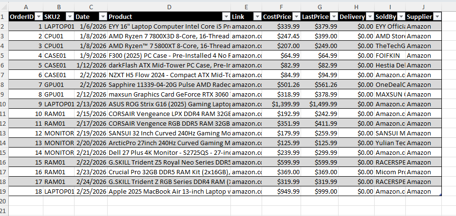
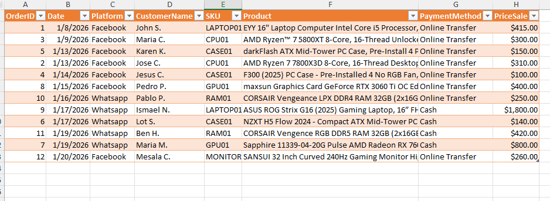
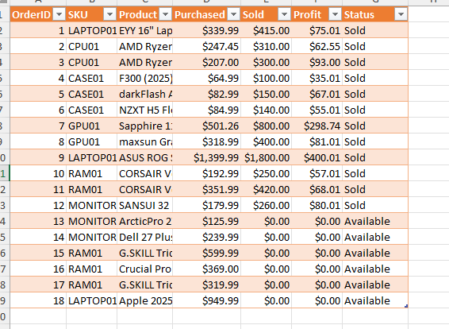
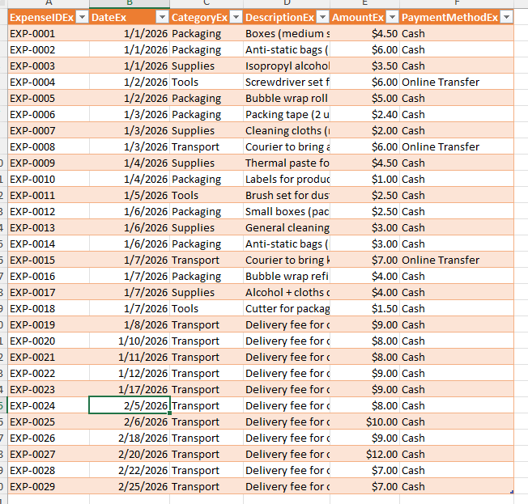
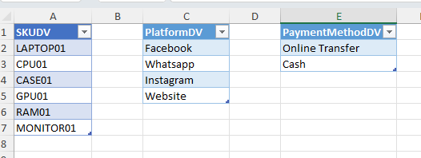

# SoloSell ERP – Excel Mini ERP for Solo Online Sellers

SoloSell ERP is a lightweight Excel-based mini ERP designed for solo online sellers and micro‑entrepreneurs. It centralizes inventory, sales, and expenses into a dynamic dashboard powered by KPIs, PivotTables, and automated analysis. Simple, fast, and fully customizable for small digital businesses.

📺 Video Tutoria
https://youtu.be/ZKQgWC_3w4w

📦 Features
- Inventory tracking with automatic profit calculation
- Sales logging with customer and platform details
- Expense management by category
- Interactive dashboard with KPIs and PivotCharts
- Timeline and slicers for dynamic filtering
- Clean structure for easy customization

## 📁 Repository Structure
```
/excel
   SoloSell_ERP.xlsx

/screenshots
   Dashboard.png
   Entry.png
   Expensives.png
   Inventory.png
   Parameters.png
   Purchases.png
   Sales.png

/docs
   data_dictionary.md
   methodology.md

README.md
```
## 📸 Screenshots

### Dashboard


### Entry (Purchases & Sales Input)


### Purchases


### Sales


### Inventory


### Expenses


### Parameters (Dropdown Lists)


## 🚀 How to Use

1. Enter your purchases and sales in the **Entry** sheet.  
2. Use the macro button to automatically register sales into the system.  
3. Check product availability and status in the **Inventory** sheet.  
4. Update dropdown lists (SKUs, platforms, payment methods) in the **Parameters** sheet.  
5. Refresh the Dashboard to update KPIs, charts, and business insights.  

### 📄 Documentation

- **Data Dictionary** → [docs/data_dictionary.docx](docs/data_dictionary.docx)  
- **Methodology** → [docs/methodology.docx](docs/methodology.docx)


## License
This project is released under the MIT License.
